# Causal effects | *Un effet causal*

## What can we learn from a randomized experiment? | *Qu'apprendre d'une expérience aléatoire?*

::: {.columns}
::: {.column .lang-en width="50%"}

We can estimate the **average causal effect** of the treatment $D$ on an outcome $Y$ for some set of units.

:::
::: {.column .lang-fr width="50%"}

Nous pouvons estimer **l'effet causal moyen** du traitement $D$ sur un résultat $Y$ d'un ensemble d'unités

:::
:::

## What do we mean by "$D$ causes $Y$"? | *Comment interpréter "D cause Y"?*

::: {.columns}
::: {.column .lang-en width="50%"}

-   We take a counterfactual approach.

-   "$D$ causes $Y$" is a claim about what didn't happen.

    -   "If $D$ had not occurred, then $Y$ would not have occurred."

    -   "With $D$, the probability of $Y$ is higher than would be
        without $D$."

:::
::: {.column .lang-fr width="50%"}

-   Nous prenons une approche contrefactuelle.

-   "$D$ cause $Y$" est une affirmation sur ce qui n'a pas eu lieu.

    -   "Si $D$ n'avait pas eu lieu, il n'y aurait pas de $Y$."

    -   "Avec $D$, la probabilité de $Y$ est plus élevée qu'elle ne le
        serait sans $D$."

:::
:::

## What do we mean by "$D$ causes $Y$"? | *Comment interpréter "D cause Y"?*

::: {.columns}
::: {.column .lang-en width="50%"}

-   "$D$ causes $Y$" requires a *context*.

    -   Small classrooms improve test scores but require experienced
        teachers and funding.

-   "$D$ causes $Y$" does not mean "$W$ does not cause $Y$."

:::
::: {.column .lang-fr width="50%"}

-   "$D$ cause $Y$" nécessite un *contexte*.

    -   Les petites salles de classe améliorent les résultats des
        examens mais nécessitent des enseignants expérimentés et un
        financement adapté.

-   "$D$ cause $Y$" n'implique pas nécessairement que $W$ ne cause pas
    $Y$.

:::
:::

## Treatments | *Traitements*

::: {.columns}
::: {.column .lang-en width="50%"}

-   We must define what having $D$ and not having $D$ mean to define a causal effect.

-   You have to define what you mean by control:

    -   Absence of any intervention.

    -   Placebo.

:::
::: {.column .lang-fr width="50%"}

-   Nous devons définir ce que signifie le fait d'avoir $D$ et de ne pas avoir $D$ pour définir un effet causal.

-   Vous devez définir votre condition de contrôle :

    -   Absence d'intervention.

    -   Placebo.

:::
:::

# Learning about the average causal effect from an experiment | *Comment apprendre l'effet causal moyen d'une expérience aléatoire*

## Research question | *La question de recherche*
{width="170px" fig-align="center"}

::: {.columns}
::: {.column .lang-en width="50%"}

-   What is the effect of drinking coffee at breakfast on energy levels right now for everyone at Learning Days?

:::
::: {.column .lang-fr width="50%"}

-   Quel est l'effet de la consommation du café au petit-déjeuner sur les niveaux d'énergie actuels des participants et instructeurs de Learning Days?

:::
:::

::: {.footnote}

Par Julius Schorzman — Travail personnel, CC BY-SA 2.0, <https://commons.wikimedia.org/w/index.php?curid=107645>

:::

## The ATE is the average of *individual* treatment effects | L'ATE est la moyenne des effets de traitement *individuels*

::: {.columns}
::: {.column .lang-en width="50%"}

-   Before defining an average treatment effect, we define a treatment effect for an individual $i$.

:::
::: {.column .lang-fr width="50%"}

-   Avant de définir l'effet *moyen de traitement*, il faut définir l'effet de traitement *pour un individu $i$*.

:::
:::

## We use a model of potential outcomes | *Nous utilisons un modèle de résultats potentiels*

::: {.columns}
::: {.column .lang-en width="50%"}

For a unit $i$, we assume that there are two *potential*
    outcomes: $Y_i(1)$ and $Y_i(0)$.

-   $Y_i(1)$ is the outcome that we *would* obtain *if* the unit were to receive
    the treatment ($D_i=1$).

-   $Y_i(0)$ is the outcome that we *would* obtain *if* the unit were to receive
    the control ($D_i=0$).

:::
::: {.column .lang-fr width="50%"}

Pour une unité $i$, nous supposons qu'il y a deux résultats
    *potentiels* : $Y_i(1)$ et $Y_i(0)$.

-   $Y_i(1)$ est le résultat qu'on *obtiendrait si* l'unité recevait le
    traitement ($D_i=1$).

-   $Y_i(0)$ est le résultat qu'on *obtiendrait si* l'unité recevait le
    contrôle ($D_i=0$).

:::
:::

## We have 12 units | *Nous avons 12 unités*

{width="320px" fig-align="center"}

## Each unit has both $Y_i(1)$ and $Y_i(0)$ | *Chaque unité a à la fois* $Y_i(1)$ et $Y_i(0)$

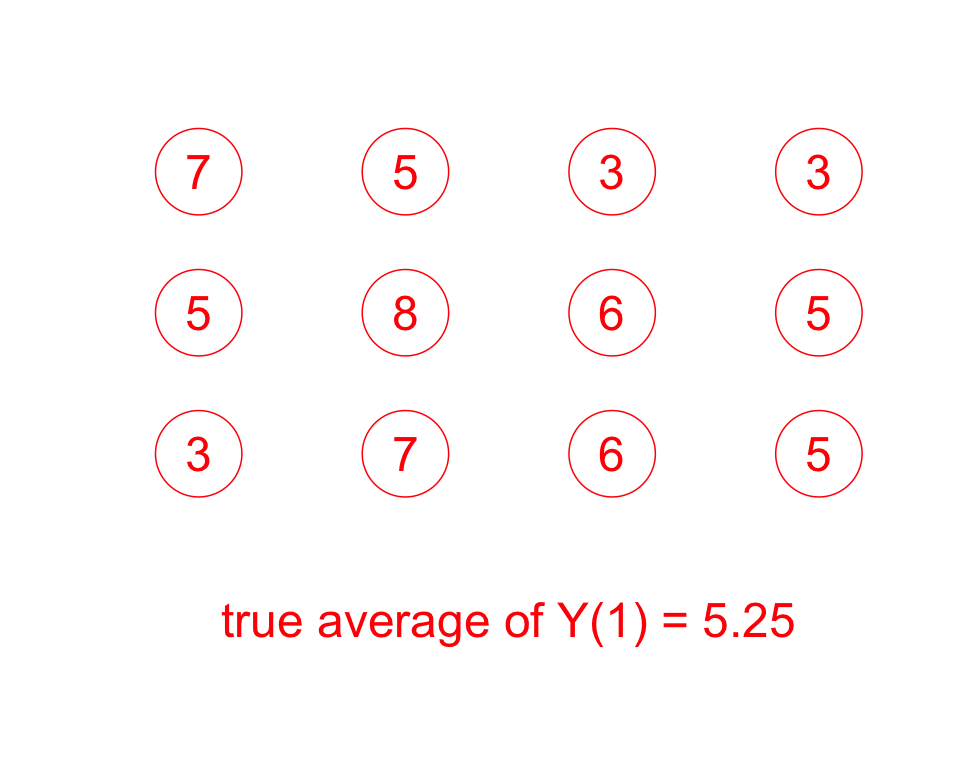{width="270px" fig-align="center"}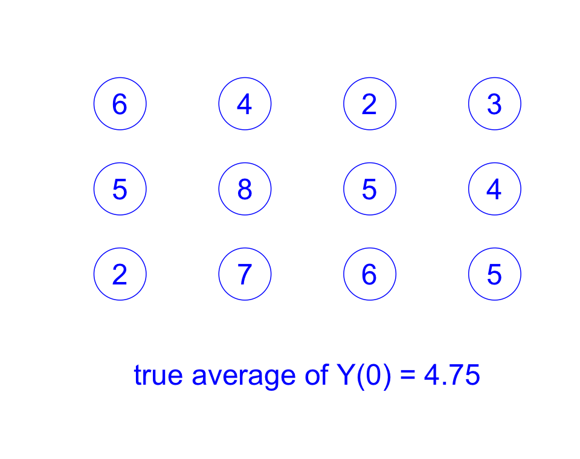{width="270px" fig-align="center"}

## The treatment effect for $i$ is defined as $\tau_i \equiv Y_i(1) - Y_i(0)$ | *L'effet de traitement pour individu $i$ est défini comme* $\tau_i \equiv Y_i(1) - Y_i(0)$

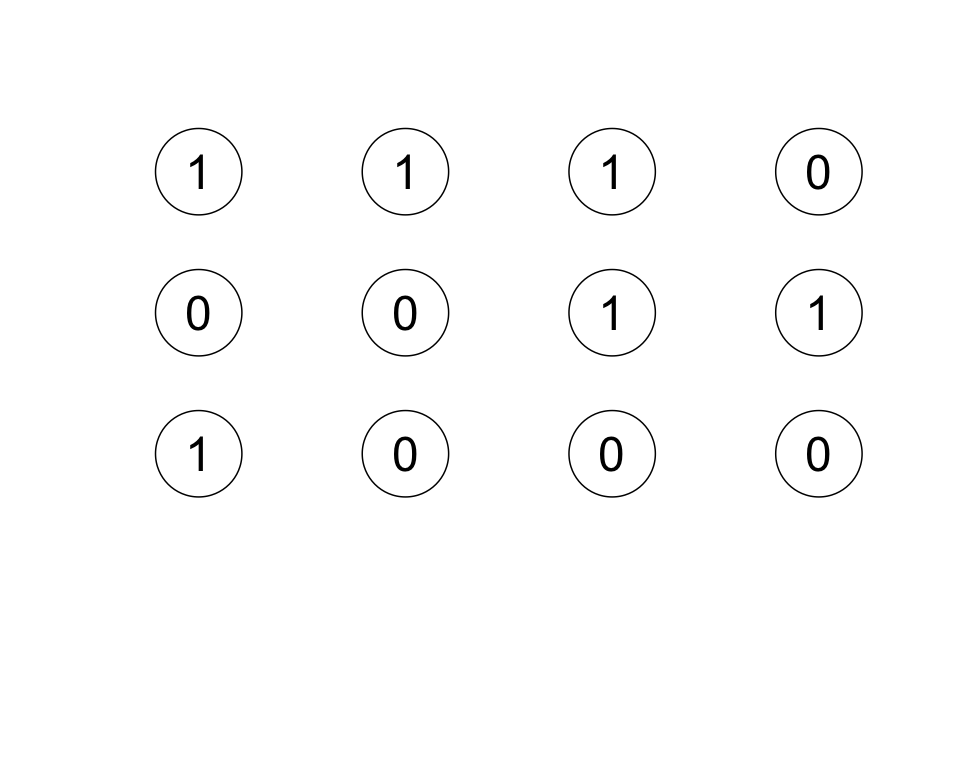{width="320px" fig-align="center"}

## Average Treatment Effect / *L'effet moyen du traitement* (ATE)  $\overline{\tau_i}= \overline{Y_i(1)-Y_i(0)}$

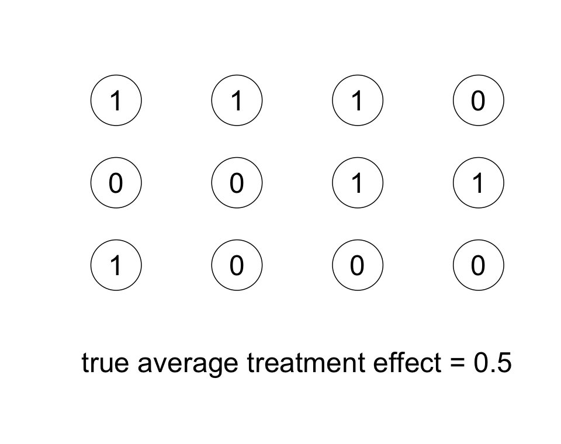{width="320px" fig-align="center"}

## Fundamental problem of causal inference | *Le problème fondamental de l'inférence causale*

::: {.columns}
::: {.column .lang-en width="50%"}

-   **We can't measure the individual-level causal effect**, because we
    can't observe both $Y_i(1)$ and $Y_i(0)$ at the same time.

-   But we can still estimate the **average treatment effect** with a
    randomized experiment.

:::
::: {.column .lang-fr width="50%"}

-   **Nous ne pouvons pas mesurer l'effet causal au niveau individuel**,
    car nous ne pouvons pas observer à la fois $Y_i(1)$ et $Y_i(0)$ pour
    un même individu.

-   Mais nous pouvons estimer **l'effet moyen du traitement**
    avec une expérience aléatoire.

:::
:::

## Let's go back to the $Y_i(1)$ | *Revenons à* $Y_i(1)$

{width="320px" fig-align="center"}

## We can take a random sample of these $Y_i(1)$ | *Sélectionnons un échantillon aléatoire de* $Y_i(1)$

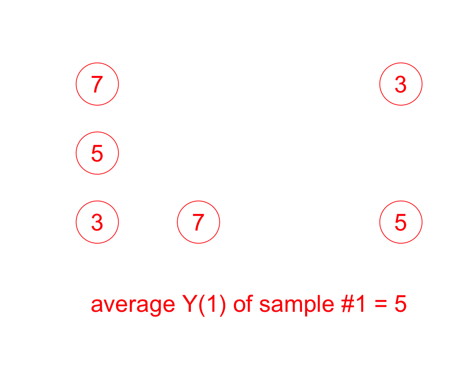{width="320px" fig-align="center"}

## We can take another random sample of these $Y_i(1)$ | *Sélectionnons un autre échantillon aléatoire de* $Y_i(1)$

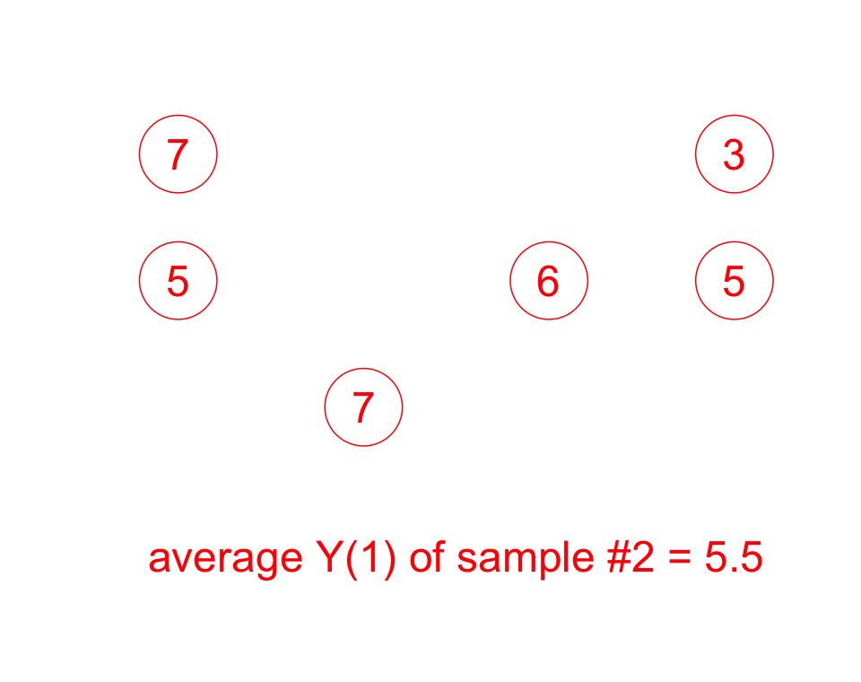{width="320px" fig-align="center"}

## And another! | *Et un autre!*

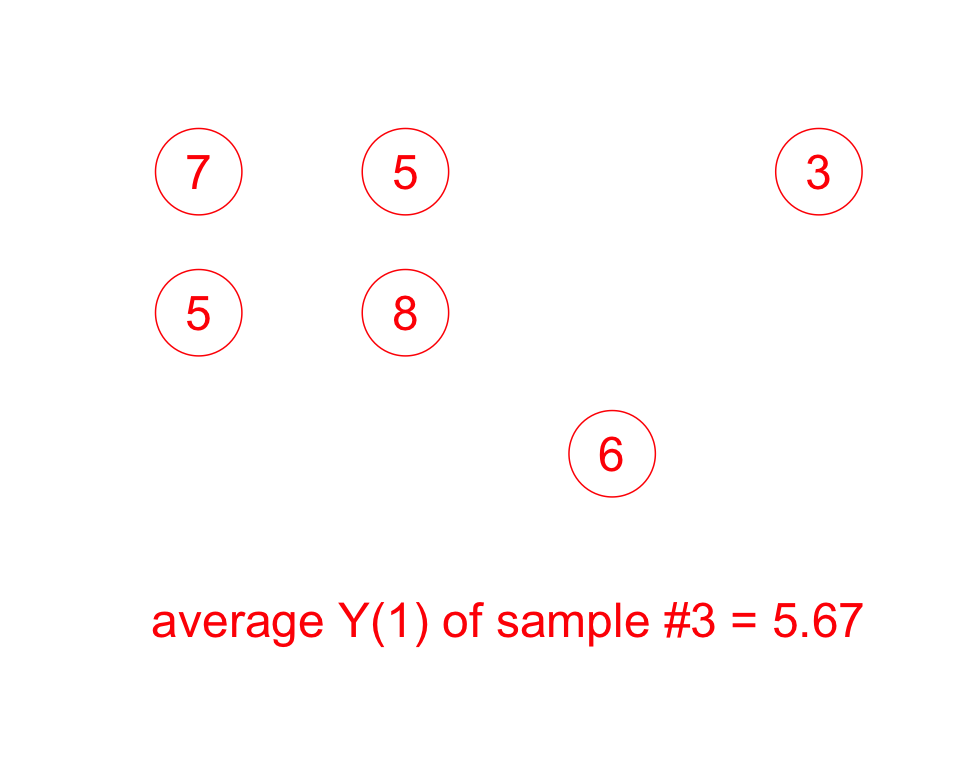{width="320px" fig-align="center"}

## Average of sample averages | *La moyenne des moyennes de l'échantillon*

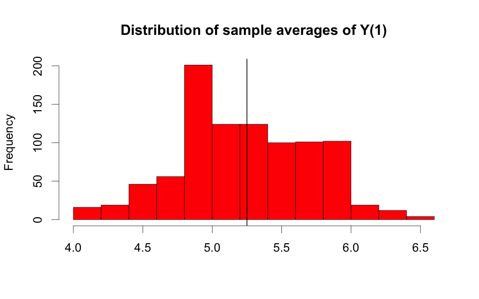{width="280px" fig-align="center"}

::: {.columns}
::: {.column .lang-en width="50%"}

-   A particular sample average will not be the true population average.

-   But the average of all the sample averages will be the true
    population average!

:::
::: {.column .lang-fr width="50%"}

-   Un échantillon particulier ne nous donnera probablement pas la vraie
    valeur.

-   Mais la moyenne de toutes les moyennes possibles est la vraie
    valeur!

:::
:::

## Connecting observed outcomes to potential outcomes | *Relier les résultats observés aux résultats potentiels*

::: {.center}

$$Y_i = D_iY_i(1) + (1-D_i)Y_i(0)$$

:::
::: {.columns}
::: {.column .lang-en width="50%"}

1.  For the treated units, the observed outcome $Y_i$ is $Y_i(1)$.  

2.  For the control units, the observed outcome $Y_i$ is $Y_i(0)$.

:::
::: {.column .lang-fr width="50%"}

1.  Pour les unités traitées, nous observons $Y_i=Y_i(1)$. 

2.  Pour les unités de contrôle, nous observons $Y_i=Y_i(0)$.

:::
:::

## A random assignment | *Une assignation aléatoire*

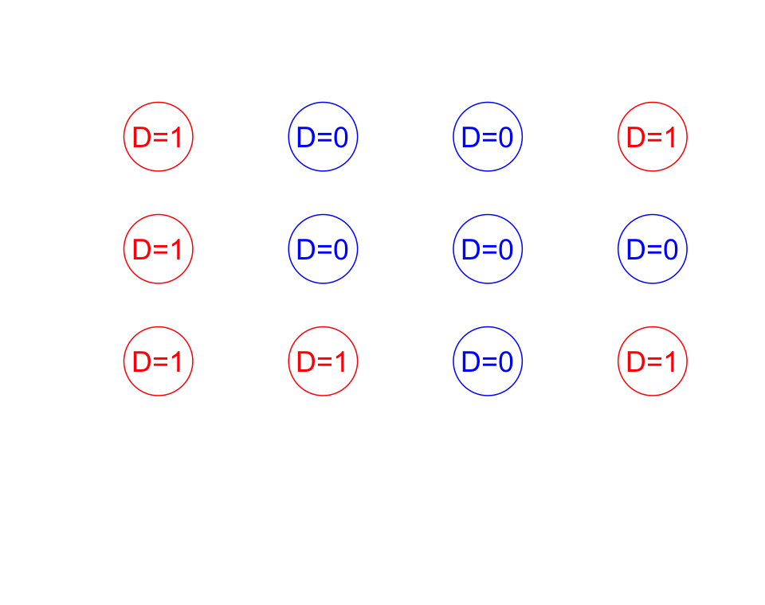{width="320px" fig-align="center"}

## We learn the outcomes and produce an estimate | *Nous apprenons les résultats et produisons une estimation*

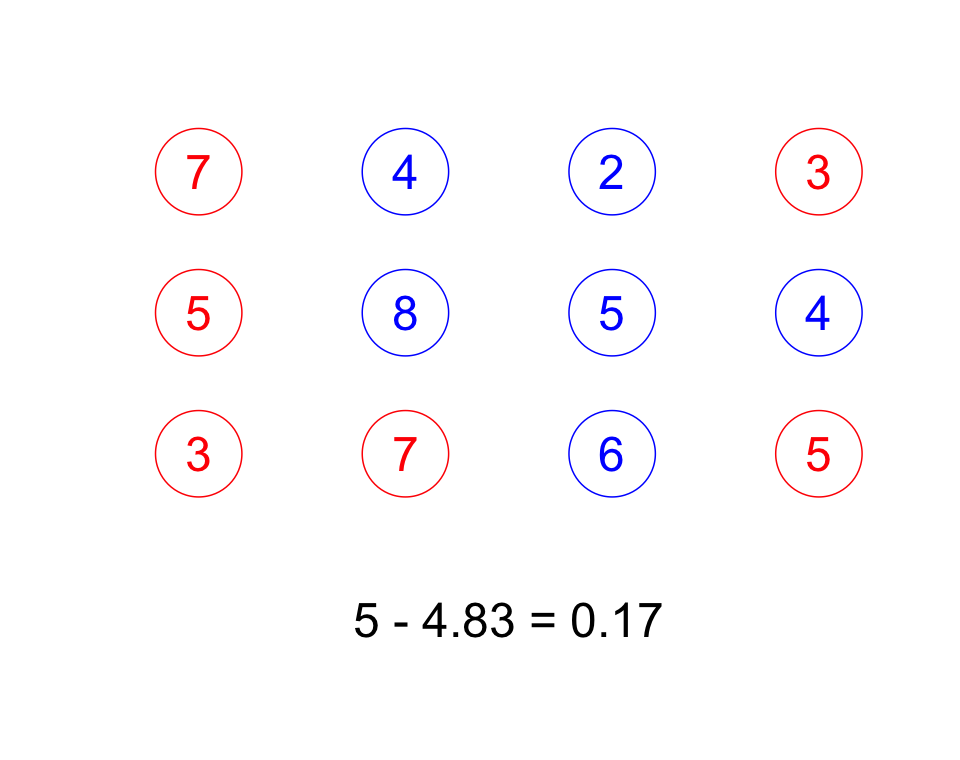{width="320px" fig-align="center"}

## A different random assignment would have produced another estimate (maybe different) | *Une assignation aléatoire différente aurait produit une autre estimation (peut-être differente)*

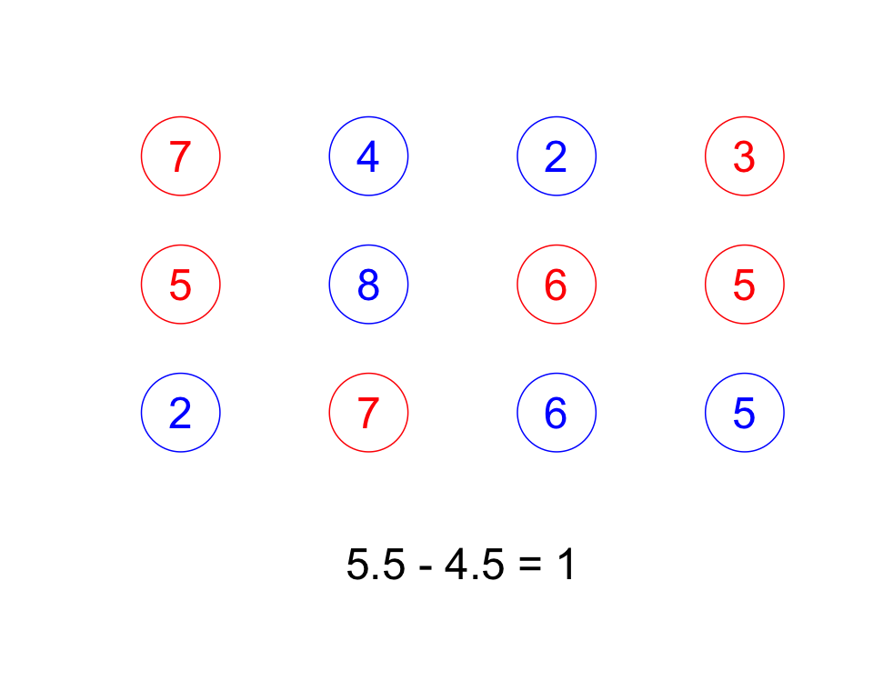{width="320px" fig-align="center"}

## Randomization is powerful | *Randomiser est puissant*
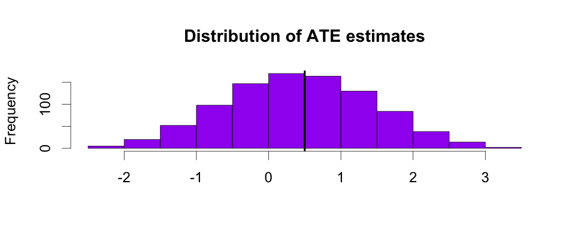{width="380px" fig-align="center"}

::: {.columns}
::: {.column .lang-en width="50%"}

-   A particular random assignment will probably not give us the true average
    treatment effect.

-   But the average of the estimates produced by all possible
    randomizations will be the true average treatment effect!

:::
::: {.column .lang-fr width="50%"}

-   Une assignation aléatoire particulière ne nous donnera probablement
    pas la vraie valeur de l'effet causal moyen de traitement.

-   Mais la moyenne de toutes les estimations possibles est la vraie
    valeur.

:::
:::

## Randomization is powerful | *Randomiser est puissant*

::: {.columns}
::: {.column .lang-en width="50%"}

Average treatment effect (ATE):

:::
::: {.column .lang-fr width="50%"}

L'effet moyen du traitement (ATE) :

:::
:::

$$
\begin{aligned}
ATE = \overline{\tau_i} &= \overline{Y_i(1)-Y_i(0)} \\
&= \overline{Y_i(1)}-\overline{Y_i(0)}
\end{aligned}
$$

::: {.columns}
::: {.column .lang-en width="50%"}

The average of a difference equals the difference of averages.

:::
::: {.column .lang-fr width="50%"}

La moyenne des différences est égale à la différence des moyennes.

:::
:::

## Randomization is powerful | *Randomiser est puissant*

$$E_R[\overline{Y_i}|D_i=1]=\overline{Y_i(1)}$$
$$E_R[\overline{Y_i}|D_i=0]=\overline{Y_i(0)}$$

::: {.columns}
::: {.column .lang-en width="50%"}

Because the units were randomly assigned to treatment, the average of the $Y_i$ for the treated units is a good estimate of the average of $Y_i(1)$ for all the units. 

The same logic applies to the units randomly assigned to control.

:::
::: {.column .lang-fr width="50%"}

Parce que les unités ont été assignées de manière aléatoire au traitement, la moyenne de $Y_i$ pour les unités traitées est une bonne estimation de la moyenne de $Y_i(1)$ pour toutes nos unités.
    

La même logique s'applique pour les unités assignées aléatoirement
    au contrôle.

:::
:::

## Randomization is powerful | *Randomiser est puissant*

$$E_R[\overline{Y_i}|D_i=1]=\overline{Y_i(1)}$$

::: {.columns}
::: {.column width="50%"}

{fig-align="center"}

:::
::: {.column width="50%"}

{fig-align="center"}

:::
:::

## Randomization is powerful | *Randomiser est puissant*
$$ATE = \overline{Y_i(1)}-\overline{Y_i(0)}$$
$$E_R[\overline{Y_i}|D_i=1]=\overline{Y_i(1)}$$
$$E_R[\overline{Y_i}|D_i=0]=\overline{Y_i(0)}$$

# Core assumptions | *Hypothèses clés*

## Core assumptions | *Hypothèses clés*

::: {.columns}
::: {.column .lang-en width="50%"}

1. Random assignment of treatment.

2.  SUTVA (Stable unit treatment value assumption).

3.  Excludability.

:::
::: {.column .lang-fr width="50%"}

1.  L'assignation aléatoire du traitement.

2.  L'hypothèse SUTVA (Hypothèse stable de la valeur de traitement d'une
    unité).

3.  La restriction d'exclusion.

:::
:::

## Core assumption 1: Random assignment of treatment | *Hypothèse clé 1 : L'assignation aléatoire du traitement*

::: {.columns}
::: {.column .lang-en width="50%"}

-   Random assignment means that each observation has a *known*
    probability of assignment to experimental conditions *between* 0 and 1.

-   No unit in the experimental sample is assigned to treatment with
    certainty (probability = 1) or to control with certainty
    (probability = 0).

    
-   It doesn't mean haphazard or uncontrolled!

:::
::: {.column .lang-fr width="50%"}

-   L'assignation aléatoire signifie que chaque observation a une
    probabilité *connue* d'assignation au traitement comprise entre 0 et 1.

-   Aucune unité de l'échantillon expérimental n'est assignée au
    traitement (probabilité = 1)  ou au contrôle avec certitude (probabilité = 0).
    

-   Cela ne signifie ni désordonné ni incontrôlé!

:::
:::

## Core assumption 1: Random assignment of treatment | *Hypothèse clé 1 : L'assignation aléatoire du traitement*

::: {.columns}
::: {.column .lang-en width="50%"}

-   Careful: Treatment assignment may be randomized, but treatment condition received may not be the same and hence not randomized.

:::
::: {.column .lang-fr width="50%"}

-   Attention ! L'assignation du traitement peut être randomisée, mais la condition du traitement reçu peut ne pas être la même que la condition assignée (donc ne pas être randomisée).

:::
:::

## Core assumption 2: SUTVA, part 1 | *Hypothèse clé 2: SUTVA, partie 1*

::: {.columns}
::: {.column .lang-en width="50%"}

2.1 No interference -- A subject's potential outcome reflects only
whether that subject receives the treatment himself/herself. It is not
affected by how treatments happen to be allocated to other subjects.

-   A classic violation is the case of vaccines and their spillover
    effects.

:::
::: {.column .lang-fr width="50%"}

2.1 L'absence de contamination -- Le résultat potentiel d'un sujet reflète
uniquement la réception du traitement par ce sujet. Il n'est pas affecté
par le statut de traitement des autres sujets.

-   Une violation classique est le cas des vaccins et de leurs effets de
    contamination.

:::
:::

## Core assumption 2: SUTVA, part 2 | *Hypothèse clé 2 : SUTVA, partie 2*

::: {.columns}
::: {.column .lang-en width="50%"}

2.2 No hidden variations of the treatment

-   Say treatment is taking a vaccine, but there are two kinds of
    vaccines and they have different ingredients.

:::
::: {.column .lang-fr width="50%"}

2.2 Pas de variations cachées du traitement

-   Disons que le traitement consiste à prendre un vaccin, mais il
    existe deux types de vaccins et ils ont des compositions
    différentes.

:::
:::

## Core assumption 3: Excludability | *Hypothèse clé 3: La restriction d'exclusion*

::: {.columns}
::: {.column .lang-en width="50%"}

3.  Treatment assignment has no effect on outcomes except through its
    effect on whether treatment was received.

-   Treatment and control groups should be treated the same, except for
    the actual treatment.

:::
::: {.column .lang-fr width="50%"}

3.  L'assignation au traitement n'a aucun effet sur les résultats, sauf
    à travers l'effet de recevoir ou non le traitement.

-   Important de maintenir la symétrie entre les groupes de traitement
    et de contrôle, excepté le statut du traitement.

:::
:::

## These assumptions are our responsibility | Ces hypothèses sont notre réponsibilité

::: {.columns}
::: {.column .lang-en width="50%"}

-   If the assumptions are not valid, the conclusions may not be trustworthy.  

-   We should design and execute our research in ways that ensure these assumptions are valid.  Check for problems when you can.

:::
::: {.column .lang-fr width="50%"}

- Si les hypothèses ne tiennent pas, les conclusions risquent de ne pas être fiables.

- Nous devons concevoir et faire nos recherches de manière à assurer la validité de ces hypothèses.  Vérifiez les problèmes lorsque vous le pouvez.

:::
:::

# Randomized experiments vs observational studies | *Études randomisées vs. études observationnelles*

## Observational studies | *Études observationnelles*

::: {.columns}
::: {.column .lang-en width="50%"}

-   Treatment is not randomly assigned. It is observed, but not
    manipulated by researchers.

-   Differences in outcomes might be due to underlying differences (selection bias)
    or the treatment, plus noise. It's often very hard to tell.

:::
::: {.column .lang-fr width="50%"}

-   Le traitement n'est pas assigné de manière aléatoire. Il est
    observé, mais pas manipulé pas les chercheurs.

-   Les différences de résultats peuvent être dues à des différences sous-jacentes
    (biais de sélection) ou au traitement, plus le bruit. C'est souvent
    très difficile à dire.

:::
:::

## Randomized studies | *Études randomisées*

::: {.columns}
::: {.column .lang-en width="50%"}

-   Randomize treatment, then measure outcomes.

-   Randomization creates two groups that we expect to be similar.  Differences before receiving treatment are only due to chance.

-   **We** create the difference with the treatment.  Therefore, we can attribute differences in outcomes to the treatment (plus
    chance) instead of other factors.

:::
::: {.column .lang-fr width="50%"}

- Randomiser le traitement, puis mesurer les résultats.

- La randomisation crée deux groupes qui devraient être similaires.  Les différences avant le traitement ne sont dues qu'au hasard.

- **Nous** créons ensuite la différence avec le traitement.  Nous pouvons donc attribuer les différences de résultats au traitement (plus
 le hasard) plutôt qu'à d'autres facteurs.
 
:::
:::

## Internal validity | *La validité interne*

::: {.columns}
::: {.column .lang-en width="50%"}

-   Randomization generally gives us internal validity -- confidence in our estimate of the causal effect of $D$ on $Y$ for our study.

-   Observational studies generally need other strong assumptions to try to deal with selection bias.

:::
::: {.column .lang-fr width="50%"}

-   La randomisation nous donne généralement une validité interne : une confiance dans notre estimation de l’effet causal de $D$ sur $Y$ pour notre étude.

-   Les études observationelles ont besoin d'autres hypothèses
    fortes pour résoudre le biais de sélection.

:::
:::

## External Validity (Generalizability) | *La validité externe (Généralisabilité) *
 
::: {.columns}
::: {.column .lang-en width="50%"}

-   The units in your study might or might not be representative of a
    larger population.

-   The conclusions from one study may not apply to other settings (i.e., not have
    external validity).

-   This is a general concern for both observational and randomized studies.

:::
::: {.column .lang-fr width="50%"}

-   Les unités de votre étude peuvent ou non être représentatives d'une
    population plus large.
    
    

-   Les conclusions d'une étude peuvent ne pas s'appliquer à d'autres contextes (i.e. manque de la validité externe).

-   C'est une préoccupation générale, tant pour les études observationnelles que pour les études randomisées.

:::
:::

## Resources | *Ressources supplémentaires*

::: {.columns}
::: {.column .lang-en width="50%"}

- EGAP Methods Guide on Randomization
  (<https://egap.org/resource/10-things-to-know-about-randomization/>)

- [EGAP's Metaketa Initiative](https://egap.org/our-work/the-metaketa-initiative/)
  works to accumulate knowledge by pre-planning a meta-analysis of
  multiple studies that have high internal validity due to randomization.

:::
::: {.column .lang-fr width="50%"}

- Guide des méthodes EGAP sur la randomisation
  (<https://egap.org/fr/resource/10-choses-a-savoir-sur-la-randomisation/>)

- [L'initiative Metaketa d'EGAP](https://egap.org/our-work/the-metaketa-initiative/)
  vise à accumuler des connaissances en pré-planifiant une méta-analyse de
  plusieurs études qui ont une validité interne élevée en raison de la
  randomisation.

:::
:::
